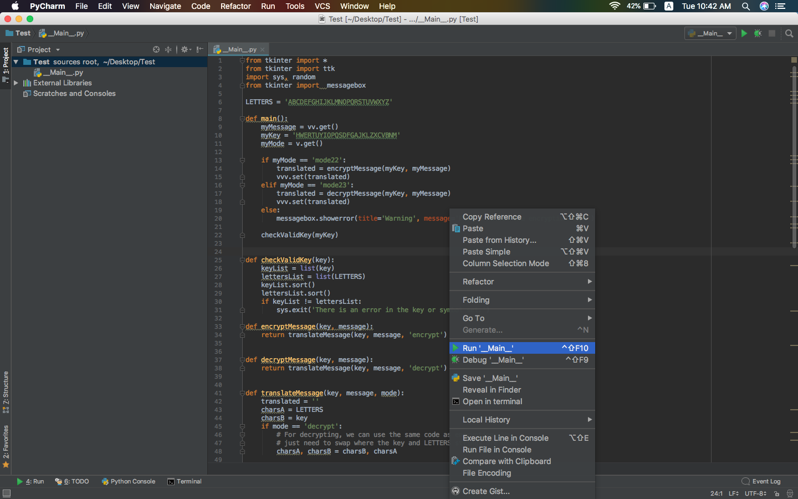
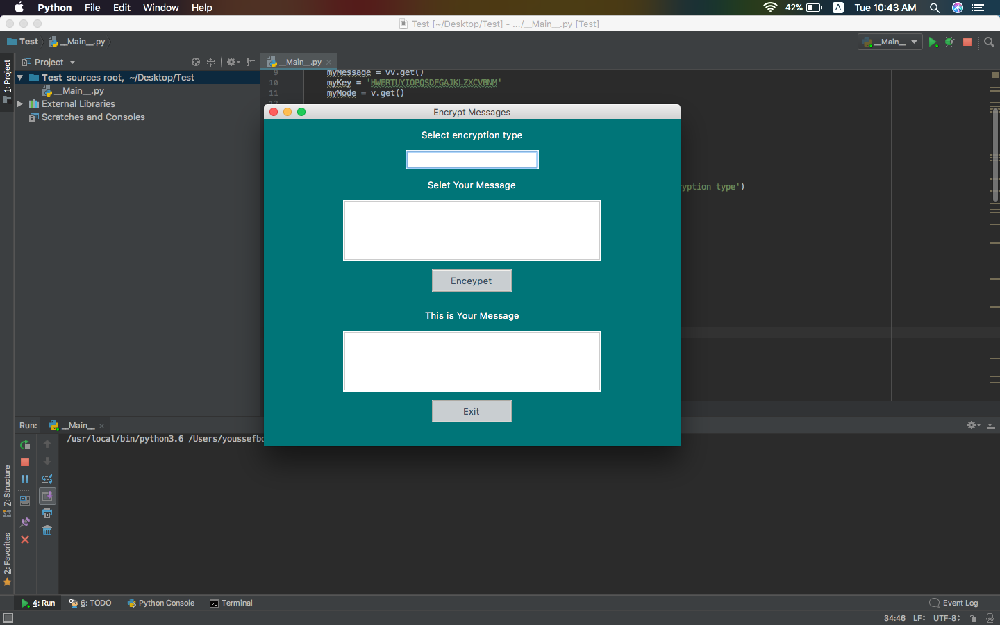

# Encrypt Messages
A program for encrypting and decrypting text messages in a single script with the use of the technology MonoAlphabetic/Substitution cipher known in the world of encryption

# MonoAlphabetic | Substitution
In cryptography, a substitution cipher is a method of encrypting by which units of plaintext are replaced with ciphertext, according to a fixed system; the "units" may be single letters (the most common), pairs of letters, triplets of letters, mixtures of the above, and so forth. The receiver deciphers the text by performing the inverse substitution.

Substitution ciphers can be compared with transposition ciphers. In a transposition cipher, the units of the plaintext are rearranged in a different and usually quite complex order, but the units themselves are left unchanged. By contrast, in a substitution cipher, the units of the plaintext are retained in the same sequence in the ciphertext, but the units themselves are altered.

There are a number of different types of substitution cipher. If the cipher operates on single letters, it is termed a simple substitution cipher; a cipher that operates on larger groups of letters is termed polygraphic. A monoalphabetic cipher uses fixed substitution over the entire message, whereas a polyalphabetic cipher uses a number of substitutions at different positions in the message, where a unit from the plaintext is mapped to one of several possibilities in the ciphertext and vice versa.

## Requirements
* Python 3.x
* Installing the following packages using brew:
	 * brew python3
* Pycharm 

## How to use the script
* Open File "__main__.py" Open it using the text editor you are using Left mouse button From the Options menu, click "Run".

* Wait until the program opens this way.

## Select the encryption type.
* mode22 
	* This is used to encrypt text messages
* mode23 
	* This is used to decrypt text messages
	
## mode22	

	
## mode23 	

Thank you for using this script under the slogan "Achieve your dream or die while you are trying"

